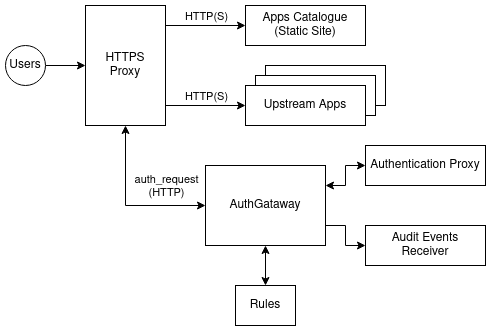

# AuthGateway
AuthGateway is a flexible authentication helper for HTTPS proxies to add user authentication and
verification to all requests received by the proxy before they are sent to upsteram HTTP(S) apps.

AuthGateway also provides some basic authorisation logic.

The aims of this project are to:

* Easily ensure HTTPS requests are authenticated.
* Easily add request auditing to your setup.
* Decuple the HTTP(S) proxy from the authentication proxy.
  * Combine any supported HTTPS proxy with any supprted authentication proxy.

## Architecture

AuthGatheway is a middleware to combine an HTTP(S) proxy with an authentication proxy.

For components to integrate correctly they must support interfaces that AuthGateway can work with:

* An HTTP(S) Proxy able to delegate authentication using the [NGINX auth_request] protocol.
* A supported authentication proxy that can verify users and return some identity information.

Supported authentication proxies:
* [OAuth2 Proxy](https://oauth2-proxy.github.io/oauth2-proxy/)

Some HTTP(S) Proxies that support `auth_request`:
* [ingress-nginx](https://kubernetes.github.io/ingress-nginx/).
* [NGINX](https://www.nginx.com/).

## Configuration
AuthGateway's configuration is loaded from a YAML file.
By default this is `authgateway.yaml` and a different file can be specified with `--config FILE`.

The configuration options available in this file are the serialised versions of the
rust structrues in the `src/config/` directoy, with the `Config` structure being the root document.

As an example configuration check out the [`authgateway.yaml`](./authgateway.yaml) file
at the root of this repo.

### Rules
In addition to the main configuration file AuthGateway supports rules to customise its
behaviour when processing requests.

Rules are applied at different phases were each phase has access to more context.
In the last phase rules can modify even the authentication response.

1. `pre-auth` rules are applied before the request is checked with the auth proxy.
2. `post-auth` rules are applied after the request is checked with the auth proxy.
3. `enrich-response` rules are able to modify AuthGateway's responses.

Rules are loaded in order from a list of files specified in the main config file.

## Deploying
The latest version of AuthGateway is intended mainly to be used in Kubernetes as an
authentication gateway for the NGINX ingress.
By desing however AuthGateway works with any HTTPS proxy that implements
the [NGINX auth_request] protocol.

An example of AuthGateway used with NGINX proxy is in the `devenv/` directory.

## Apps Catalogue
Up to version 0.4.x of AuthGateway a built-in Applications Catalogue was available.
Since version 0.5.0 onward the entire interface was removed and only the proxy API is provided.

To provide a simple catalouge similar to what used to be provided you can use static
site generators tools.
On the roadmap is the creation of a [hugo] theme to make this process simpler.

The Applications Catalogue was removed from the proxy process for a few reasons:

* AuthGateway is now simpler and has less to focus on.
* Other catalogue solutions can be used in more complex/dynamic setups.
* The built-in catalogue did not work well with the desired to use of Kubernetes service ingress.

## Roadmap
This project is a one-person hobby operation.
And this one person has other hobby projects to work on.
As a result desired but not essential features of AuthGateway won't be available for a while.

This roadmap hopes to track what will hopefully be added.

* GitHub Actions for tests and code linting.
* Full Kubernetes ingress demo.
* Introspection with OpenTelemetry integration.
* (Possibly) HTTPS Proxy configuration helper utility.

[hugo]: https://gohugo.io/
[NGINX auth_request]: https://nginx.org/en/docs/http/ngx_http_auth_request_module.html
